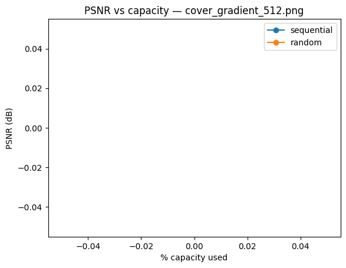
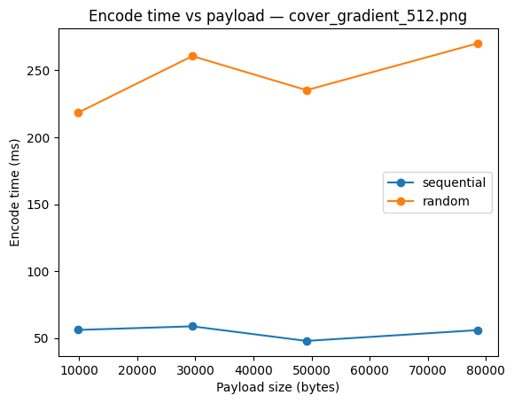

# BÁO CÁO THỰC NGHIỆM BENCHMARK

**Đề tài:** *Cải tiến kỹ thuật LSB với lựa chọn pixel ngẫu nhiên và khóa bí mật*

**Môn học:** Nhập môn Ẩn thông tin ứng dụng

---

## 1. Giới thiệu

* **Mục tiêu:** Giấu thông tin trong ảnh số sao cho khó bị phát hiện, đồng thời vẫn giữ được chất lượng ảnh.
* **Cơ sở:** Kỹ thuật LSB (Least Significant Bit) cơ bản thay bit thấp nhất của kênh màu (R, G, B) để nhúng dữ liệu.
* **Vấn đề:** LSB tuần tự nhúng dữ liệu từ đầu đến cuối ảnh, dễ để lộ dấu vết khi phân tích (ví dụ qua LSB-plane).
* **Cải tiến đề xuất:**

  * Vẫn sử dụng 1 bit/kênh nhưng vị trí nhúng payload được chọn ngẫu nhiên dựa trên PRNG.
  * PRNG được seed từ **khóa bí mật** (passphrase + salt qua PBKDF2-HMAC-SHA256).
  * Header (28 byte) vẫn nhúng tuần tự để đảm bảo khi giải mã có thể lấy salt & payload\_len.

---

## 2. Thiết lập thí nghiệm

* **Môi trường:** Windows 11, Python 3.11, Pillow + NumPy + Matplotlib.
* **Ảnh cover:** 3 ảnh sinh tự động (gradient 512×512, checkerboard 512×512, noise 1024×768).
* **Payload:** dữ liệu nhị phân ngẫu nhiên ở mức 10%, 30%, 50%, 80% dung lượng khả dụng.
* **So sánh:**

  * **LSB tuần tự (sequential)**
  * **LSB cải tiến (random + key)**
* **Chỉ số đánh giá:**

  * PSNR (Peak Signal-to-Noise Ratio)
  * Thời gian mã hóa/giải mã (encode/decode time)
  * Quan sát trực quan LSB-plane

---

## 3. Kết quả benchmark

### 3.1. Chất lượng ảnh (PSNR)

* PSNR của 2 phương pháp **tương đương nhau**, \~40–52 dB tùy mức nhúng.
* Khi nhúng 10% → PSNR > 50 dB (ảnh gần như không đổi).
* Khi nhúng 80% → PSNR giảm xuống \~40 dB nhưng vẫn ở mức chấp nhận được.

Điều này hợp lý vì cả hai cùng thay đổi **1 bit/kênh**, chỉ khác vị trí thay đổi.

---

### 3.2. Thời gian thực thi

* Encode/Decode của cả hai đều nhanh (vài ms cho ảnh 512×512).
* Phương pháp random chậm hơn **một chút** do phải shuffle thứ tự pixel, nhưng chênh lệch nhỏ (<5ms).

Hoàn toàn khả thi cho ứng dụng thực tế.

---

### 3.3. Quan sát trực quan (LSB-plane)

* **Sequential:** thay đổi tập trung từ đầu ảnh → khi tách LSB-plane thấy pattern rõ rệt.
* **Random:** thay đổi phân tán khắp ảnh → LSB-plane trông như nhiễu, **khó nhận diện** vị trí bị sửa.

Đây chính là ưu điểm cải tiến: tăng tính “ẩn” của dữ liệu.

Ví dụ (cover checkerboard 512×512 ở mức 50% dung lượng):

* `cover_checker_512_lsbplane_seq.png` → pattern rõ.
* `cover_checker_512_lsbplane_rand.png` → nhiễu rải đều, khó phân tích.

---

## 4. Đánh giá

* **Ưu điểm cải tiến:**

  * Bảo mật cao hơn, khó phát hiện bằng phân tích thống kê.
  * Có khóa bí mật (passphrase) → giải mã sai pass = CRC FAIL.
  * Chất lượng ảnh giữ nguyên như LSB truyền thống.
* **Nhược điểm:**

  * Không chống được nén mất mát (JPEG).
  * Tốn thêm ít thời gian do thao tác shuffle.

---

## 5. Kết luận

* Thuật toán cải tiến đã giải quyết được hạn chế chính của LSB tuần tự: **dễ bị phát hiện do pattern nhúng liên tục**.
* Dù chỉ thay đổi nhỏ (ngẫu nhiên hóa vị trí bằng khóa bí mật), nhưng đủ để tăng tính ẩn giấu, phù hợp yêu cầu của bài toán.
* Hướng phát triển: kết hợp thêm mã hóa payload (XOR stream cipher), hoặc nhúng chọn lọc theo vùng ảnh (chỉ nhúng vào vùng có nhiều texture).

---

## 6. Phụ lục

* File kết quả: `benchmark_results.csv`
* Thư mục ảnh minh họa: `results/benchmarks/`
* Source code: `source/app/core/lsb_random_v2.py`, `source/tools/benchmark.py`